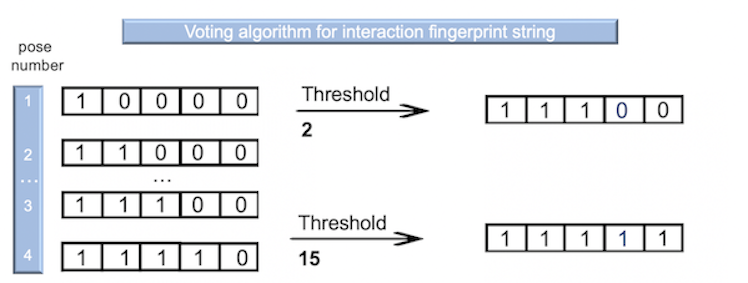

In this project, the aim is to construct a classification model that can anticipate the accumulation of compounds within gram-negative bacterial cells.

# Exploring and cleaning the Data

The data set comprises of compound names and their corresponding SMILES representations (187 compounds all together). Additionally, it includes information such as the formal charge of each compound, permeability coefficients for developing a regression model, and accumulation classes for constructing a classification model. The data set also contains residue data obtained during the docking algorithm, which is represented by an interaction fingerprint string. Each residue is encoded with zeros and ones to denote different types of interactions, including hydrogen bonds (HAccep, HDonor, and Ar-Hbond), halogen bonds (XBond), salt-bridge interactions (Salt), pi-cation interactions (PiCat), pi-pi interactions (PiFace, PiEdge), and hydrophobic interactions (HPhob). Each compound has from 13 to 15 conformations after docking. 
```{r include=FALSE}
library(dplyr)
library(ggplot2)
library(plotly)
library(glue)
library(corrplot)
library(Rtsne)
library(tidymodels)
library('fastDummies')
library(randomForest)
library(caret)
library(patchwork)
library(gridExtra)
library(e1071)
library(class)
library(sjmisc)
library(rpart.plot)
```

```{r}
data <- read.csv("data_final_project_cleaned.csv")
dim(data)
names(data[, 0:10])
```
The data set consists of 2605 poses, accompanied by 784 generated interaction features by docking algorithm, and 6 essential general properties necessary for model construction.
After uploading the data, a crucial step involves searching for NaN values. The presence of NaN values in the interaction fingerprint indicates that the compound was successfully docked within the channel, but no specific types of interactions were detected. To change it, NaN values were substituted with "0", meaning the absence of the interaction. 
```{r}
anyNA(data)
data[is.na(data)] <- as.integer(0)
```
 It is worth noting that some interaction fingerprint features may have identical values, resulting in their insignificance for data point separation. Below is a summary of some of these specific features.
```{r}
summary(data[, 7:10])
```
Next, our focus will shift towards removing these particular features and using remaining ones for exploration.
```{r}
list_residues = names(data[, 7:790])

myList_delete <- c()
myList_save <- c()
for (name in list_residues) {
  sum_value = sum(data[name])
  if (sum_value == 0) {
    myList_delete <- append(myList_delete, name) }
  else {
    myList_save <- append(myList_save, name) }
}
df = data[,!(names(data) %in% myList_delete)]
glue('Number of features to save: {length(myList_save)}. 
     Number of features to delete {length(myList_delete)}.')
```
Based on the literature, we have identified 6 crucial residues that are highly favorable for interactions, leading to a significant increase in accumulation value (ASP113, GLU117, ARG132, ARG82, ARG42, LYS16). Notably, binding to ASP113 greatly enhances the compound's penetration capability. Subsequently, we have created lists including all found types of interactions facilitated by these 6 key residues.
```{r}
asp113 <- c("A.113.ASP..HDonor.nc", "A.113.ASP..HDonor.cc", "A.113.ASP..HDonor.nn", 
    "A.113.ASP..HDonor.cn", "A.113.ASP..Salt", "A.113.ASP..HPhob")
glu117 <- c("A.117.GLU..HDonor.nc", "A.117.GLU..HDonor.cn", "A.117.GLU..HDonor.nn", 
    "A.117.GLU..HDonor.cc","A.117.GLU..Salt", "A.117.GLU..HPhob", "A.117.GLU..XBond")
arg132 <- c("A.132.ARG..HAccep.nn", "A.132.ARG..HAccep.cn", "A.132.ARG..HAccep.cc", 
    "A.132.ARG..HAccep.nc","A.132.ARG..XBond","A.132.ARG..Salt", "A.132.ARG..PiCat" )
arg82 <-  c("A.82.ARG..HAccep.nn", "A.82.ARG..HAccep.cn", "A.82.ARG..HAccep.cc", 
    "A.82.ARG..HAccep.nc", "A.82.ARG..XBond","A.82.ARG..Salt","A.82.ARG..PiCat")
agr42 <-  c("A.42.ARG..HAccep.nn", "A.42.ARG..HAccep.cn", "A.42.ARG..HAccep.cc", 
    "A.42.ARG..HAccep.nc","A.42.ARG..XBond", "A.42.ARG..Salt","A.42.ARG..PiCat", 
    "A.42.ARG..HPhob")
lys16 <-  c("A.16.LYS..HAccep.cn", "A.16.LYS..HAccep.cc", "A.16.LYS..XBond", 
    "A.16.LYS..Salt", "A.16.LYS..PiCat", "A.16.LYS..HPhob")
list_important_res <-list(list1 = asp113, list2 = glu117, 
                          list3 = arg132 , list4= arg82 , list5 = lys16, list6 = agr42)
```

Given that each compound consists of approximately 13-15 poses, we plan to employ the "Voting algorithm" for the interaction fingerprint strings. This algorithm will enable us to select a representative interaction fingerprint string from the 15 available poses, effectively describing our compound's interactions.The "Voting algorithm" is described on the picture below.



A threshold of "2" means an interaction exists in at least half of the poses to be considered in the compound. Similarly, a threshold of "15" means an interaction exists in at least one pose to be considered in the compound.
Explored thresholds: 1, 2, 3, 4, 5, 6, 7, 8, 9, 10, 11, 12, 13, 14, 15. 

Additionally, we have established individual columns for all significant residues, utilizing binary notation with zeros and ones. In this context, a value of "1" signifies the presence of at least one interaction type, such as hydrogen bonds, halogen bonds, salt-bridge interactions, pi-cation interactions, pi-pi interactions, or hydrophobic interactions. A value of "0" indicates the absence of these interactions.

```{r}
threshold_list <- c(1, 2, 3, 4, 5, 6, 7, 8, 9, 10, 11, 12, 13, 14, 15)
empty_dict <- list()
real_data = data.frame(matrix(ncol = 182, nrow = 0))
colnames(real_data) <- c(names(df))

for (number in threshold_list) {
  empty_dict[[paste0("df_threshold_", number)]] <- real_data  
  for (name in unique(df$name)) {
    small_data = df[df['name'] == name ,]
    threshold = dim(small_data)[1]/number
    list_values_row <- c(small_data[1,][, 0:6])
    for (residue in myList_save) {
    sum_value = sum(small_data[residue])
    
    if (sum_value >= threshold) {
      list_values_row<-append(list_values_row, as.integer(1))
    } else {
      list_values_row<- append(list_values_row, as.integer(0)) }
    }
    empty_dict[[paste0("df_threshold_", number)]][nrow(empty_dict
                            [[paste0("df_threshold_", number)]]) + 1,] <- list_values_row
  }
    for (column_p in list_important_res) {
      new_col <- c()
      for (index in rownames(empty_dict[[paste0("df_threshold_", number)]])) {
        sum_res = sum(empty_dict[[paste0("df_threshold_", number)]][index, column_p])
        
        if (sum_res > 0) {
          new_col<-append(new_col, as.integer(1))
        } else {
          new_col<- append(new_col, as.integer(0)) }
      }
      name_Y =paste0("residue", strsplit(column_p[1], split = '[.]')[[1]])
      empty_dict[[paste0("df_threshold_", number)]][name_Y[2]] <- new_col
    }
}
```
Eventually, we ended up with 15 new dataframes that describe different thresholds. These dataframes were all placed in the 'empty_dict' dictionary for future use.

# Exploratory data analysis

Besides the interaction fingerprint we have a formal charge feature. So, Let's have a look how formal charge can influence on the Permeability coefficient. 
```{r fig.height = 2, fig.width = 5}
ggplot(empty_dict$df_threshold_6, aes(x = as.character(FormalCharge) ,
  y = Permeability.coefficient)) + geom_boxplot(fill = "skyblue", color = "black") +
  labs(x = "Charge", y = "Permeability.coefficient", 
  title = "Charge influence on permeability coefficient")
```

It's quite clear from the plot that formal charge plays a significant role in distinguishing the data points, with molecules carrying a positive charge demonstrating a higher permeability coefficient.

After implementing the voting algorithm, our focus shifts to examining the simultaneous influence of charge and an essential residue (ASP113) on the Permeability coefficient. The plot below illustrates the results for a threshold of 6. Notably, positively charged compounds that interact with ASP113 display significantly higher Permeability coefficients.
**It is worth to mention that graphs for all thresholds were build, but results are presented on selected threshold, which gives more insights about the data.**
```{r fig.height = 3, fig.width = 8}
ggplot(empty_dict$df_threshold_6, aes(x=as.character(FormalCharge), 
    y=Permeability.coefficient, fill=as.character(residue113))) + 
    geom_boxplot() + facet_wrap(~FormalCharge, scale="free") +
    labs(x = "Charge + ASP113", y = "Permeability.coefficient", 
    title = "Impact of ASP113 on Permeability coefficient across various charges")
```
We were curious about whether having many different interactions is important or if only six crucial ones would be enough to describe the data. To find out, we created a plot for threshold 15 to see how the number of interactions affects the permeability coefficient. We also did the same analysis for only important residues and their impact on the permeability coefficient.
**It is worth to mention that graphs for all thresholds were build, but results are presented on selected threshold, which gives more insights about the data.**

```{r echo=TRUE, fig.height=5, fig.width=10, message=FALSE, warning=FALSE, paged.print=FALSE}
graths = c()
#all residues
for (number in threshold_list) {
  number_interaction <- c()
  for (index in rownames(empty_dict[[paste0("df_threshold_", number)]])) {
        sum_res = sum(empty_dict[[paste0("df_threshold_", number)]]
              [index, 7:(dim(empty_dict[[paste0("df_threshold_", number)]])[2] - 6 )])
        number_interaction  <- append(number_interaction, sum_res) }
  empty_dict[[paste0("df_threshold_", number)]]['all_interactions'] <- number_interaction
}
selected_threshold_list = c(15)
for (number in selected_threshold_list) {
  plot = ggplot(empty_dict[[paste0("df_threshold_", number)]], 
    aes(x = Permeability.coefficient, y = all_interactions, 
    label = empty_dict[[paste0("df_threshold_", number)]]$Accumulation_class, 
    col = Accumulation_class)) + geom_point() + ggrepel::geom_text_repel(cex = 2.5) +
    labs(x = "Permeability.coefficient", 
         y = "Number of all possible interactions", title = "All residues")
  graths[['all_int']] = plot 
}
# five important residues
list_pp  <- c("residue113","residue117", "residue132", "residue82", "residue16", "residue42")
for (number in threshold_list) {
  number_interaction <- c()
  for (index in rownames(empty_dict[[paste0("df_threshold_", number)]])) {
        sum_res = sum(empty_dict[[paste0("df_threshold_", number)]][index, list_pp])
        number_interaction  <- append(number_interaction, sum_res) }
  empty_dict[[paste0("df_threshold_", number)]]['all_important_residues'] <- 
    number_interaction }
for (number in selected_threshold_list) {
  plot_imp = ggplot(empty_dict[[paste0("df_threshold_", number)]],
    aes(x = Permeability.coefficient, y = all_important_residues,
    label = empty_dict[[paste0("df_threshold_", number)]]$Accumulation_class, 
    col = Accumulation_class)) + geom_point() + ggrepel::geom_text_repel(cex = 2.5) +
    labs(x = "Permeability.coefficient", 
         y = "Number of interactions with important residues", title = "Selected residues")
  graths[['all_int_imp']] = plot_imp }
graths_plot <- grid.arrange(grobs=graths,ncol=2, nrow = 1)
```

From the plots we obtained for the **threshold 15**, we can make the conclusion that the presence of six important residues has a greater influence on the permeability coefficient. Therefore, having many interactions does not seem to make much sense in this context.

After implementing the "Voting algorithm," several features from the interaction fingerprint might end up with identical values, leading to their lack of significance in separating data points. The number of such features varies for each threshold, depending on the strictness of the threshold applied. Therefore, the following code aims to clean the created data set for each threshold, retaining only features with distinct values that could potentially be useful for constructing a model.

```{r}
for (number in threshold_list) {
  list_residues = names(empty_dict[[paste0("df_threshold_", number)]][, 7:182])
  myList_delete <- c()
  myList_save <- c()
  for (name in list_residues) {
    sum_value = sum(empty_dict[[paste0("df_threshold_", number)]][name])
    if (sum_value == 0) {
      myList_delete <- append(myList_delete, name)
    } else {
      myList_save <- append(myList_save, name) }
  }
  empty_dict[[paste0("df_threshold_", number)]] = empty_dict[[paste0
    ("df_threshold_", number)]][,!(names(empty_dict[[paste0("df_threshold_", number)]]) 
                                       %in% myList_delete)]
}  
```
With the removal of NaN values and features containing duplicate values from all dataframes, we are now almost ready to proceed with dimensionality reduction analysis and further model building.
Initially, it is crucial to scale the "Formalcharge" feature to bring it within a range from 0 to 1. Fortunately, the interaction fingerprint string is already in binary notation with zeros and ones.
After scaling the "Formalcharge" feature, we have deleted several properties that were only created for plot building. As a result, our data is now fully prepared and ready for further analysis and model development!

```{r}
delete_list <- c( "residue113", "residue117", "residue132", "residue82", "residue16",
                  "residue42", "all_interactions", "all_important_residues")
for (number in threshold_list) {
  empty_dict[[paste0("df_threshold_", number)]]['FormalCharge'] <- 
    predict(preProcess(empty_dict[[paste0("df_threshold_", number)]]['FormalCharge'], 
    method=c("range")), empty_dict[[paste0("df_threshold_", number)]]['FormalCharge'])
  empty_dict[[paste0("df_threshold_", number)]] = empty_dict[[paste0
      ("df_threshold_", number)]][,!(names(empty_dict[[paste0("df_threshold_", number)]])
                                       %in% delete_list)] }
```
# Principal component analysis
We used PCA to assess thresholds' impact on data separability. Threshold 1 led to overlaps and prediction errors. However, with threshold 15, we observed significant improvements as it managed to effectively separate the different compounds. 

```{r fig.height=4, fig.width=10, warning=FALSE}
threshold_list_pca = c(1, 15)
graths_pca = c()
for (number in threshold_list_pca) {
  prcomp_df_threshold_3 <- prcomp(empty_dict[[paste0
    ("df_threshold_", number)]][, 7: dim(empty_dict[[paste0
    ("df_threshold_", number)]])[2]])
  
  pca_df_threshold_3 <- data.frame(
    PC1 = prcomp_df_threshold_3$x[, 1],
    PC2 = prcomp_df_threshold_3$x[, 2],
    classification = empty_dict[[paste0("df_threshold_", number)]]$Accumulation_class,
    label = empty_dict[[paste0("df_threshold_", number)]]$Accumulation_class)
  plot = ggplot(pca_df_threshold_3, aes(x = PC1, y = PC2, label = label, 
    col = classification)) + geom_point() + ggrepel::geom_text_repel(cex = 2.5) +
    labs(x = "PC1", y = "PC2", title = number)
  graths_pca[[glue("threshold_{number}")]] = plot
}
graths_plot_pca <- grid.arrange(grobs=graths_pca,ncol=2, nrow = 1)
```

# Preparing data for model building
After conducting various types of analysis and data preparation, the next step is to construct the model. However, before proceeding, adjustments are needed for the target value column. Instead of using the "High" and "Low" labels, it is crucial to switch to a binary representation using zeros and ones.Furthermore, the data exhibits imbalance, which will be considered when splitting the data into training and test sets. 
```{r}
for (number in threshold_list) {
  high_low <- c()
  for (index in rownames(empty_dict[[paste0("df_threshold_", number)]])) {
        high_low_value = empty_dict[[paste0("df_threshold_", number)]][index,
                                                          "Accumulation_class"]
        if (high_low_value == 'High') {
          high_low = append(high_low, as.character(1))
        } else {
          high_low = append(high_low, as.character(0)) }
  }
  empty_dict[[paste0("df_threshold_", number)]]['High_Low_value'] <- high_low
}
empty_dict$df_threshold_3 %>% count(High_Low_value) %>% mutate(prop = n/sum(n))
```
# Algorithms for classification models
For the construction of the classification model, four main algorithms were selected: Random Forest, Decision Tree, Support Vector Machine, and K-Nearest Neighbors. Multiple dictionaries were established to store the obtained results, including threshold values, accuracy scores, balanced accuracy scores, and confusion matrixes.
```{r}
classifiers_to_use = c('Random Forest', 'Decition tree', 'SVM', 'KNN')
models_dict <- list() #results dictionary 
conf_matrix <- list() # confusion matrix dictionary
accuracy_matrix <- list() # balanced accuracy dictionary

model_data = data.frame(matrix(ncol = 3, nrow = 0))
colnames(model_data) <- c("Threshold", "Accuracy" , "Balanced_Accuracy")
for (classifier in classifiers_to_use) {
  models_dict[[classifier]] <- model_data
  conf_matrix[[classifier]] <- model_data
  accuracy_matrix[[classifier]] <- 0 }
```
The provided script involves the construction of 60 models in total (15 thresholds for each of the 4 algorithms discussed earlier). At this stage, there is no parameter tuning involved. The main objective is to compare and determine which threshold performs better for each type of model. 

```{r message=FALSE, warning=FALSE}
set.seed(171)
for (number in threshold_list) {
  #data split  
  split_threshold <- initial_split(empty_dict[[paste0("df_threshold_", number)]] %>% 
        select(-Canonical.SMILES, -Ligand, -Permeability.coefficient, -name, 
        -Accumulation_class), strata=as.integer(empty_dict[[paste0
        ("df_threshold_", number)]]$High_Low_value), prop = 7/10)
  
  split_threshold_train <- training(split_threshold)
  split_threshold_test  <- testing(split_threshold)
  
  split_threshold_train$High_Low_value  <- as.factor(split_threshold_train$High_Low_value)
  split_threshold_test$High_Low_value <- as.factor(split_threshold_test$High_Low_value)
  # WHAT MODEL TO USE?
  for (name_cl in classifiers_to_use) {
    
    if (name_cl == "Random Forest") {
      rf_mod = rand_forest(trees = 1000) %>% set_engine("ranger") %>% 
        set_mode("classification")
    }
    if (name_cl == "Decition tree") {
      rf_mod = decision_tree() %>% set_engine("rpart") %>% set_mode("classification")
    }
    if (name_cl == "SVM") {
      rf_fit = svm(formula = High_Low_value ~ ., data = split_threshold_train,
                 type = 'C-classification', kernel = "linear")
    }
    if (name_cl == "KNN") {
      rf_fit = knn(train = split_threshold_train, test = split_threshold_test,
                      cl = split_threshold_train$High_Low_value, k = 3)
    }
    #fitting model
    if (name_cl == 'Random Forest' | name_cl == 'Decition tree') {
      rf_fit <- rf_mod %>% fit(High_Low_value ~ ., data = split_threshold_train)
    }
    if (name_cl == 'Random Forest' | name_cl == 'Decition tree' | name_cl == 'SVM') {
      rf_testing_pred <- 
      predict(rf_fit, split_threshold_test[-dim(split_threshold_test)[2]]) %>% 
        bind_cols(predict(rf_fit, 
        split_threshold_test[-dim(split_threshold_test)[2]], type = "prob")) %>% 
        bind_cols(split_threshold_test %>% select(High_Low_value))
    } else {
      rf_testing_pred <- rf_fit %>% 
        bind_cols(split_threshold_test %>% select(High_Low_value))
    }
    # Accuracy calculation
    acc = rf_testing_pred %>%                   
      accuracy(truth =High_Low_value, colnames(rf_testing_pred[1]))
    
    baL_acc = rf_testing_pred %>%                   
    bal_accuracy(truth =High_Low_value, colnames(rf_testing_pred[1]))
    
    models_dict[[name_cl]][nrow(models_dict[[name_cl]]) + 1,] <- 
      c(number, acc %>% pull(.estimate), baL_acc %>% pull(.estimate))
    
    #confusion matrix
    if (baL_acc %>% pull(.estimate) > accuracy_matrix[[name_cl]]) {
      conf_matrix[[name_cl]] <- confusionMatrix(data=rf_testing_pred
        [[colnames(rf_testing_pred[1])]], reference = rf_testing_pred$High_Low_value)
      accuracy_matrix[[name_cl]] = baL_acc %>% pull(.estimate)
    }
  }
}
```
By building a plot below eventually we can notice some tendencies in model performance based on balanced accuracy values obtained. First of all, comparing thresholds "1" and "15" for each algorithm (except K-Nearest Neighbors) we are able to conclude: predictive ability is higher with an increasing the threshold value. At the same time, there are some fluctuations in the balanced accuracy values between the strict threshold "1" and more loyal "15". 

An interesting observation arises with the K-Nearest Neighbors algorithm, where we observed balanced accuracy spanning between 0.7 and 1. The achieved balanced accuracy of "1" at threshold "1" can potentially be explained by the prior PCA analysis, where numerous duplicates were identified.

Based on obtained graphs the "Decision tree" algorithm was used for further tuning as it has balanced accuracy values in a range from 0.5 to 0.9, exhibiting comparatively fewer fluctuations. The K-Nearest Neighbors algorithm was ignored due to the project's focus on tuning the Decision tree algorithm and exploring the employed features for the model. 

```{r echo=FALSE, fig.height=4, fig.width=6, message=FALSE, warning=FALSE}
plots = c()
for (name_cl in classifiers_to_use) {
hgh = models_dict[[name_cl]]
oo =ggplot(hgh, aes(x=Threshold, y=Balanced_Accuracy)) +
  geom_point()+ geom_line() + xlab("Thresholds") + ylab("Balanced accuracy") +
  ylim(0.4, 1.0 )+ stat_smooth()+ ggtitle(name_cl)
plots[[name_cl]] = oo 
}
grid.arrange(grobs=plots,ncol=2, nrow = 2)
```

# Model tuning for decision tree
Based on the provided graphs above we are not able to choose which threshold is better as it is only one splitting on test and train sets from from numerous potential options. Consequently, the "k-fold" cross-validation technique was subsequently applied. In this method, the data was randomly divided into k partitions (with a default value of 10 in our case) to obtain a more accurate estimation of the model's performance.
The significant advantage of cross-validation is it **uses all the training data** to build and evaluate the final model.
```{r echo=FALSE, fig.height=3, fig.width=8, message=FALSE, warning=FALSE}
set.seed(67)
fitControl <- trainControl(method = "repeatedcv", repeats = 1)
graths_DT = c()
one_plot =ggplot(models_dict[['Decition tree']], aes(x=Threshold, y=Accuracy)) +
  geom_point()+ geom_line() + xlab("Thresholds") + ylab("Accuracy") +
  ylim(0.6, 1 )+ stat_smooth()+ ggtitle('Without cross fold validation')
graths_DT[['AC before tuning']] = one_plot

cv_model= data.frame(matrix(ncol = 2, nrow = 0))
colnames(cv_model) <- c("Threshold" , "Accuracy")

for (number in threshold_list) {
  
  DTModel <- train(High_Low_value ~ ., data = empty_dict[[paste0
    ("df_threshold_", number)]] %>% select(-Canonical.SMILES, -Ligand,
    -Permeability.coefficient, -name, -Accumulation_class),
                  method = "rpart", 
                  trControl = fitControl , metric = 'Accuracy')
  res_DTModel = DTModel$resample
  DTAccuracy <-mean(res_DTModel$Accuracy)
  
  cv_model[nrow(cv_model) + 1,] <- c(number, DTAccuracy)
}
two_plot = ggplot(cv_model, aes(x=Threshold, y=Accuracy)) +
  geom_point()+ geom_line() + xlab("Thresholds") + ylab("Accuracy") +
  ylim(0.6, 1)+ stat_smooth()+ ggtitle('Cross fold validation, 10 folds')
graths_DT[['AC after tuning']] = two_plot
grid.arrange(grobs=graths_DT,ncol=2, nrow = 1)
```
By examining the results of average accuracy among 10 folds, we reduced score fluctuations between different thresholds. The average accuracy values is in a range from 0.7 to 0.85, which is a great starting point to tune and ultimately select the optimal threshold.
From the plots above, the most favorable accuracy score was achieved with threshold 9, while threshold 13 was also considered during the evaluation.

After analyzing the obtained results, we have decided to tune the ninth threshold by adjusting two key parameters: *cost_complexity* and *tree_depth*. By using the *tree_grid* function, reasonable values were created for *cost_complexity* and *tree_depth* hyperparameters to experiment with, offering 5 options for each. As we have two parameters to tune, we ended up with a total of 25 distinct potential tuning combinations to test.
```{r fig.height=3, fig.width=6, warning=FALSE}
set.seed(278)
tune_spec <- decision_tree(cost_complexity = tune(), tree_depth = tune()) %>% 
    set_engine("rpart") %>% set_mode("classification")
  
tree_grid <- grid_regular(cost_complexity(), tree_depth(),levels = 5)
  
empty_dict$df_threshold_9$High_Low_value<- as.factor(
                              empty_dict$df_threshold_9$High_Low_value)
thr_folds <- vfold_cv(empty_dict$df_threshold_9 %>% select(-Canonical.SMILES, 
                -Ligand, -Permeability.coefficient, -name, -Accumulation_class))
  
tree_wf <- workflow() %>% add_model(tune_spec) %>% add_formula(High_Low_value ~ .)
  
tree_res <- tree_wf %>% tune_grid(resamples = thr_folds, grid = tree_grid)
    
tree_res %>%
    collect_metrics() %>% mutate(tree_depth = factor(tree_depth)) %>%
    ggplot(aes(cost_complexity, mean, color = tree_depth)) +
    geom_line(size = 0.5, alpha = 0.6) + geom_point(size = 2) +
    facet_wrap(~ .metric, scales = "free", nrow = 2) +
    scale_x_log10(labels = scales::label_number()) +
    scale_color_viridis_d(option = "plasma", begin = 1, end = 0)+
    labs(title = '9 threshold')
```

Based on our analysis, it's evident that the tree model with a depth of 1 performs poorly based on both accuracy and ROC metrics, regardless of the various cost_complexity values tested. In contrast, the tree model with a depth of 4 exhibited improved results, particularly concerning accuracy (although depth 15 shared similarities with other *tree_depth* values). Therefore, we can infer that for a depths more than 4 and a cost_complexity value less than 0.01, the model produces acceptable and favorable outcomes.

# Final model
```{r}
best_tree <- tree_res %>% select_best("accuracy")
best_tree
```
The most favorable hyper parameters for the decision tree are *cost_complexity* set to 1e-10 and *tree_depth* set to 4.Based on the plot above, our conclusion remains the same. 
The decision tree workflow has been finalized by integrating the optimal hyperparameters that were previously identified. To conclude, we will now apply this model to the training dataset and utilize our test data to check the model's performance.

```{r}
final_wf <- tree_wf %>% finalize_workflow(best_tree)

empty_dict$df_threshold_9$High_Low_value = as.character(empty_dict$df_threshold_9$
                                                          High_Low_value)
empty_dict$df_threshold_9$High_Low_value_dublicate = empty_dict$df_threshold_9$
                                                          High_Low_value

empty_dict$df_threshold_9$High_Low_value = as.factor(empty_dict$df_threshold_9$
                                                       High_Low_value)

split_threshold <- initial_split(empty_dict$df_threshold_9 %>% select(
  -Canonical.SMILES, -Ligand, -Permeability.coefficient, -name, 
  -Accumulation_class, -High_Low_value_dublicate), prop = 7/10, 
  strata=as.integer(empty_dict$df_threshold_9$High_Low_value_dublicate))

split_threshold_train <- training(split_threshold)
split_threshold_test  <- testing(split_threshold)

split_threshold$High_Low_value  <- as.factor(split_threshold$High_Low_value)

final_fit <- final_wf %>% last_fit(split_threshold) 
```

```{r}
final_fit %>% collect_predictions() %>% accuracy(truth =High_Low_value, .pred_class) 
```
Eventually, we achieved an accuracy of 0.84 on a test set for the decision tree model.
```{r fig.height=3, fig.width=5, warning=FALSE}
final_tree <- extract_workflow(final_fit)
final_tree %>% extract_fit_engine() %>% rpart.plot(roundint = FALSE)
```

The above plot illustrates the important variables for the model and how the decision tree makes decisions concerning the accumulation class of the compounds.
```{r}
confusionMatrix(data=(final_fit %>% collect_predictions())$.pred_class,
                reference =(final_fit %>% collect_predictions())$High_Low_value)
```
Based on our findings, it can be inferred that the Random Forest algorithm, when applied to *threshold 9*, yields great outcomes with a notable accuracy score of 0.84. It's crucial to highlight that the original data set exhibited imbalances, leading to difficulties in accurate predictions for compounds with high accumulation values (evident from the confusion matrix).

Throughout the process, the initial data set was cleansed, potential thresholds were evaluated, and crucial exploratory data analyses were executed. A range of classification algorithms were also tested, with the Decision Tree algorithm being tuned to achieve a notable accuracy score specifically for *threshold 9*.

The model's performance might be improved with further data balancing or other techniques to address the class imbalance issue. 
